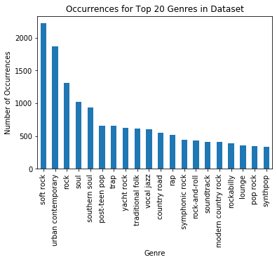
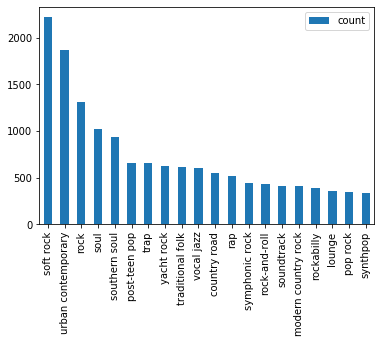

# Predictive Model on Spotify Dataset

 **Predict if a song will a hit or not**

Link to spotify dataset: https://www.kaggle.com/theoverman/the-spotify-hit-predictor-dataset

## Import Data


```python
import numpy as np
import pandas as pd

%matplotlib inline
import matplotlib.pyplot as plt
import seaborn as sns

np.random.seed(24)

import os
import glob

import requests
import json
import time
import math
import collections

from sklearn.model_selection import train_test_split, GridSearchCV
from sklearn.neighbors import KNeighborsClassifier
from sklearn.svm import LinearSVC
from sklearn.tree import DecisionTreeClassifier
from sklearn.ensemble import RandomForestClassifier
```


```python
all_filenames = [x for x in glob.glob('*.{}'.format('csv'))]
all_filenames
```


    ['combined_dataset_of_60s_to_10s.csv',
     'dataset-of-00s.csv',
     'dataset-of-10s.csv',
     'dataset-of-60s.csv',
     'dataset-of-70s.csv',
     'dataset-of-80s.csv',
     'dataset-of-90s.csv']


```python
# Combine all csv files and output a single csv file that contains all the data

# Commenting out this code as the files have been combined and outputted. 

# import re

#combined = []
#for file in all_filenames:
#    df = pd.read_csv(file)
#    df['source'] = re.findall("(\d+)", file)[0]+'s'
#    combined.append(df)
#combined_csv = pd.concat(combined)
#combined_csv.to_csv("combined_dataset_of_60s_to_10s.csv")
```


```python
all_data = pd.read_csv("combined_dataset_of_60s_to_10s.csv")  
all_data.head(2)
```


<div>
<style scoped>
    .dataframe tbody tr th:only-of-type {
        vertical-align: middle;
    }

    .dataframe tbody tr th {
        vertical-align: top;
    }

    .dataframe thead th {
        text-align: right;
    }
</style>
<table border="1" class="dataframe">
  <thead>
    <tr style="text-align: right;">
      <th></th>
      <th>Unnamed: 0</th>
      <th>track</th>
      <th>artist</th>
      <th>uri</th>
      <th>danceability</th>
      <th>energy</th>
      <th>key</th>
      <th>loudness</th>
      <th>mode</th>
      <th>speechiness</th>
      <th>...</th>
      <th>instrumentalness</th>
      <th>liveness</th>
      <th>valence</th>
      <th>tempo</th>
      <th>duration_ms</th>
      <th>time_signature</th>
      <th>chorus_hit</th>
      <th>sections</th>
      <th>target</th>
      <th>source</th>
    </tr>
  </thead>
  <tbody>
    <tr>
      <th>0</th>
      <td>0</td>
      <td>Lucky Man</td>
      <td>Montgomery Gentry</td>
      <td>spotify:track:4GiXBCUF7H6YfNQsnBRIzl</td>
      <td>0.578</td>
      <td>0.471</td>
      <td>4</td>
      <td>-7.270</td>
      <td>1</td>
      <td>0.0289</td>
      <td>...</td>
      <td>0.0</td>
      <td>0.159</td>
      <td>0.532</td>
      <td>133.061</td>
      <td>196707</td>
      <td>4</td>
      <td>30.88059</td>
      <td>13</td>
      <td>1</td>
      <td>00s</td>
    </tr>
    <tr>
      <th>1</th>
      <td>1</td>
      <td>On The Hotline</td>
      <td>Pretty Ricky</td>
      <td>spotify:track:1zyqZONW985Cs4osz9wlsu</td>
      <td>0.704</td>
      <td>0.854</td>
      <td>10</td>
      <td>-5.477</td>
      <td>0</td>
      <td>0.1830</td>
      <td>...</td>
      <td>0.0</td>
      <td>0.148</td>
      <td>0.688</td>
      <td>92.988</td>
      <td>242587</td>
      <td>4</td>
      <td>41.51106</td>
      <td>10</td>
      <td>1</td>
      <td>00s</td>
    </tr>
  </tbody>
</table>
<p>2 rows × 21 columns</p>
</div>


## Data Preparation and Preliminary Analysis


```python
dataset = all_data.copy()

# Dropping the "Unnamed: 0" / index column as it is no longer useful

dataset = dataset.loc[:, 'track':]
dataset.head(2)
```


<div>
<style scoped>
    .dataframe tbody tr th:only-of-type {
        vertical-align: middle;
    }

    .dataframe tbody tr th {
        vertical-align: top;
    }

    .dataframe thead th {
        text-align: right;
    }
</style>
<table border="1" class="dataframe">
  <thead>
    <tr style="text-align: right;">
      <th></th>
      <th>track</th>
      <th>artist</th>
      <th>uri</th>
      <th>danceability</th>
      <th>energy</th>
      <th>key</th>
      <th>loudness</th>
      <th>mode</th>
      <th>speechiness</th>
      <th>acousticness</th>
      <th>instrumentalness</th>
      <th>liveness</th>
      <th>valence</th>
      <th>tempo</th>
      <th>duration_ms</th>
      <th>time_signature</th>
      <th>chorus_hit</th>
      <th>sections</th>
      <th>target</th>
      <th>source</th>
    </tr>
  </thead>
  <tbody>
    <tr>
      <th>0</th>
      <td>Lucky Man</td>
      <td>Montgomery Gentry</td>
      <td>spotify:track:4GiXBCUF7H6YfNQsnBRIzl</td>
      <td>0.578</td>
      <td>0.471</td>
      <td>4</td>
      <td>-7.270</td>
      <td>1</td>
      <td>0.0289</td>
      <td>0.3680</td>
      <td>0.0</td>
      <td>0.159</td>
      <td>0.532</td>
      <td>133.061</td>
      <td>196707</td>
      <td>4</td>
      <td>30.88059</td>
      <td>13</td>
      <td>1</td>
      <td>00s</td>
    </tr>
    <tr>
      <th>1</th>
      <td>On The Hotline</td>
      <td>Pretty Ricky</td>
      <td>spotify:track:1zyqZONW985Cs4osz9wlsu</td>
      <td>0.704</td>
      <td>0.854</td>
      <td>10</td>
      <td>-5.477</td>
      <td>0</td>
      <td>0.1830</td>
      <td>0.0185</td>
      <td>0.0</td>
      <td>0.148</td>
      <td>0.688</td>
      <td>92.988</td>
      <td>242587</td>
      <td>4</td>
      <td>41.51106</td>
      <td>10</td>
      <td>1</td>
      <td>00s</td>
    </tr>
  </tbody>
</table>
</div>


```python
dataset.shape
```


    (41106, 20)


```python
dataset.info()
```

    <class 'pandas.core.frame.DataFrame'>
    RangeIndex: 41106 entries, 0 to 41105
    Data columns (total 20 columns):
     #   Column            Non-Null Count  Dtype  
    ---  ------            --------------  -----  
     0   track             41106 non-null  object 
     1   artist            41106 non-null  object 
     2   uri               41106 non-null  object 
     3   danceability      41106 non-null  float64
     4   energy            41106 non-null  float64
     5   key               41106 non-null  int64  
     6   loudness          41106 non-null  float64
     7   mode              41106 non-null  int64  
     8   speechiness       41106 non-null  float64
     9   acousticness      41106 non-null  float64
     10  instrumentalness  41106 non-null  float64
     11  liveness          41106 non-null  float64
     12  valence           41106 non-null  float64
     13  tempo             41106 non-null  float64
     14  duration_ms       41106 non-null  int64  
     15  time_signature    41106 non-null  int64  
     16  chorus_hit        41106 non-null  float64
     17  sections          41106 non-null  int64  
     18  target            41106 non-null  int64  
     19  source            41106 non-null  object 
    dtypes: float64(10), int64(6), object(4)
    memory usage: 6.3+ MB


```python
dataset.describe()
```


<div>
<style scoped>
    .dataframe tbody tr th:only-of-type {
        vertical-align: middle;
    }

    .dataframe tbody tr th {
        vertical-align: top;
    }

    .dataframe thead th {
        text-align: right;
    }
</style>
<table border="1" class="dataframe">
  <thead>
    <tr style="text-align: right;">
      <th></th>
      <th>danceability</th>
      <th>energy</th>
      <th>key</th>
      <th>loudness</th>
      <th>mode</th>
      <th>speechiness</th>
      <th>acousticness</th>
      <th>instrumentalness</th>
      <th>liveness</th>
      <th>valence</th>
      <th>tempo</th>
      <th>duration_ms</th>
      <th>time_signature</th>
      <th>chorus_hit</th>
      <th>sections</th>
      <th>target</th>
    </tr>
  </thead>
  <tbody>
    <tr>
      <th>count</th>
      <td>41106.000000</td>
      <td>41106.000000</td>
      <td>41106.000000</td>
      <td>41106.000000</td>
      <td>41106.000000</td>
      <td>41106.000000</td>
      <td>41106.000000</td>
      <td>41106.000000</td>
      <td>41106.000000</td>
      <td>41106.000000</td>
      <td>41106.000000</td>
      <td>4.110600e+04</td>
      <td>41106.000000</td>
      <td>41106.000000</td>
      <td>41106.000000</td>
      <td>41106.000000</td>
    </tr>
    <tr>
      <th>mean</th>
      <td>0.539695</td>
      <td>0.579545</td>
      <td>5.213594</td>
      <td>-10.221525</td>
      <td>0.693354</td>
      <td>0.072960</td>
      <td>0.364197</td>
      <td>0.154416</td>
      <td>0.201535</td>
      <td>0.542440</td>
      <td>119.338249</td>
      <td>2.348776e+05</td>
      <td>3.893689</td>
      <td>40.106041</td>
      <td>10.475673</td>
      <td>0.500000</td>
    </tr>
    <tr>
      <th>std</th>
      <td>0.177821</td>
      <td>0.252628</td>
      <td>3.534977</td>
      <td>5.311626</td>
      <td>0.461107</td>
      <td>0.086112</td>
      <td>0.338913</td>
      <td>0.303530</td>
      <td>0.172959</td>
      <td>0.267329</td>
      <td>29.098845</td>
      <td>1.189674e+05</td>
      <td>0.423073</td>
      <td>19.005515</td>
      <td>4.871850</td>
      <td>0.500006</td>
    </tr>
    <tr>
      <th>min</th>
      <td>0.000000</td>
      <td>0.000251</td>
      <td>0.000000</td>
      <td>-49.253000</td>
      <td>0.000000</td>
      <td>0.000000</td>
      <td>0.000000</td>
      <td>0.000000</td>
      <td>0.013000</td>
      <td>0.000000</td>
      <td>0.000000</td>
      <td>1.516800e+04</td>
      <td>0.000000</td>
      <td>0.000000</td>
      <td>0.000000</td>
      <td>0.000000</td>
    </tr>
    <tr>
      <th>25%</th>
      <td>0.420000</td>
      <td>0.396000</td>
      <td>2.000000</td>
      <td>-12.816000</td>
      <td>0.000000</td>
      <td>0.033700</td>
      <td>0.039400</td>
      <td>0.000000</td>
      <td>0.094000</td>
      <td>0.330000</td>
      <td>97.397000</td>
      <td>1.729278e+05</td>
      <td>4.000000</td>
      <td>27.599793</td>
      <td>8.000000</td>
      <td>0.000000</td>
    </tr>
    <tr>
      <th>50%</th>
      <td>0.552000</td>
      <td>0.601000</td>
      <td>5.000000</td>
      <td>-9.257000</td>
      <td>1.000000</td>
      <td>0.043400</td>
      <td>0.258000</td>
      <td>0.000120</td>
      <td>0.132000</td>
      <td>0.558000</td>
      <td>117.565000</td>
      <td>2.179070e+05</td>
      <td>4.000000</td>
      <td>35.850795</td>
      <td>10.000000</td>
      <td>0.500000</td>
    </tr>
    <tr>
      <th>75%</th>
      <td>0.669000</td>
      <td>0.787000</td>
      <td>8.000000</td>
      <td>-6.374250</td>
      <td>1.000000</td>
      <td>0.069800</td>
      <td>0.676000</td>
      <td>0.061250</td>
      <td>0.261000</td>
      <td>0.768000</td>
      <td>136.494000</td>
      <td>2.667730e+05</td>
      <td>4.000000</td>
      <td>47.625615</td>
      <td>12.000000</td>
      <td>1.000000</td>
    </tr>
    <tr>
      <th>max</th>
      <td>0.988000</td>
      <td>1.000000</td>
      <td>11.000000</td>
      <td>3.744000</td>
      <td>1.000000</td>
      <td>0.960000</td>
      <td>0.996000</td>
      <td>1.000000</td>
      <td>0.999000</td>
      <td>0.996000</td>
      <td>241.423000</td>
      <td>4.170227e+06</td>
      <td>5.000000</td>
      <td>433.182000</td>
      <td>169.000000</td>
      <td>1.000000</td>
    </tr>
  </tbody>
</table>
</div>


# Spotify Track Genre, JSON parsing


```python
"""
s_key expired, get new one at
https://developer.spotify.com/console/get-several-artists/?ids=0oSGxfWSnnOXhD2fKuz2Gy,3dBVyJ7JuOMt4GE9607Qin
"""
s_key = 'BQDK4Dt1Q8tOuIaCSZVx1bau_bOM7xjoJHuV59RPdFoMkJaxLrTb_pnypZygGAdNjshnQEIb_YE6XatULr6HH-SAME540IKJumKRAGU0MUcBU_6IKMY7Z_uX8PWDpNbVfKkUU2Im'
spotify_key = 'Bearer ' + s_key
def getArtist(track_id):
    track_url = 'https://api.spotify.com/v1/tracks/'
    track_id = str(track_id) + '?market=US'

    header = {'Authorization': spotify_key, 'Content-Type': 'application/json'}
    param = {'market':'US'}
    full_url = track_url + track_id

    track_temp = requests.get(full_url, headers=header)
    temp_txtt = json.loads(track_temp.text)
    *_, artist_id = temp_txtt['album']['artists'][0]['uri'].split(':')
    return artist_id
```


```python
def genreFromTrack(track_id):
    track_url = 'https://api.spotify.com/v1/tracks/'
    track_id = str(track_id) + '?market=US'

    header = {'Authorization': spotify_key, 'Content-Type': 'application/json'}
    param = {'market':'US'}
    full_url = track_url + track_id

    track_temp = requests.get(full_url, headers=header)
    temp_txtt = json.loads(track_temp.text)
    *_, artist_id = temp_txtt['album']['artists'][0]['uri'].split(':')
    artist_url = 'https://api.spotify.com/v1/artists/'
    artist_temp = requests.get(artist_url+artist_id, headers=header)

    temp_genre = json.loads(artist_temp.text)
    return temp_genre['genres']
```


```python

```


```python
def trackToArtistList(track_id_list):
    track_url = 'https://api.spotify.com/v1/tracks'
    track_id = '?ids='
    for l in track_id_list:
        track_id += str(l) + '%2C'
    track_id = track_id[:-3]

    header = {'Authorization': spotify_key, 'Content-Type': 'application/json'}
    param = {'market':'US'}
    full_url = track_url + track_id

    track_temp = requests.get(full_url, headers=header, params = param)
    temp_txtt = json.loads(track_temp.text)
    """*_, artist_id = temp_txtt['album']['artists'][0]['uri'].split(':')
    artist_url = 'https://api.spotify.com/v1/artists/'
    artist_temp = requests.get(artist_url+artist_id, headers=header)

    temp_genre = json.loads(artist_temp.text)"""
    return temp_txtt
```


```python
def artistToGenreList(artist_id_list):
    artist_url = 'https://api.spotify.com/v1/artists'
    artist_id = '?ids='
    for l in artist_id_list:
        artist_id += str(l) + '%2C'
    artist_id = artist_id[:-3]

    header = {'Authorization': spotify_key, 'Content-Type': 'application/json'}
    full_url = artist_url + artist_id

    track_temp = requests.get(full_url, headers=header)
    temp_txtt = json.loads(track_temp.text)
    return temp_txtt
```


```python
track_id_list = []
for uri in dataset['uri'].values:
    *_, tmp_uri = uri.split(':')
    track_id_list.append(tmp_uri)
```

## Insert Genre for Track in Table


```python
splits_num = math.ceil(len(dataset)/50) #trackToArtistList can only handle 50 requests at a time, limited by spotify
```


```python
track_id_list_tmp = np.array_split(np.array(track_id_list), splits_num)
```


```python
artist_ids = []
for i in track_id_list_tmp:
    tmp_r = trackToArtistList(i)
    for n in tmp_r['tracks']:
        *_, tmp_uri = n['album']['artists'][0]['uri'].split(':')
        artist_ids.append(tmp_uri)
```


```python
len(artist_ids)
```


    41106


```python
"""artist_id_list = []
for n in artist_id_resp['tracks']:
    *_, tmp_uri = n['album']['artists'][0]['uri'].split(':')
    artist_id_list.append(tmp_uri)"""
```


```python
artist_id_list = np.array_split(np.array(artist_ids), splits_num)
```


```python
genres_list = []
for i in artist_id_list:
    tmp_r = artistToGenreList(i)
    for n in tmp_r['artists']:
        genres_list.append(n['genres'])
```


```python
len(genres_list)
```


    41106


```python
tmp_r = artistToGenreList(['3bGXaFVQLASmDMdjjeJr8a','6XwcepfAsPhrvwziGxhwju','7zDtfSB0AOZWhpuAHZIOw5'])
lil_list = []
for n in tmp_r['artists']:
    lil_list.append(n['genres'])
lil_list
```


    [['contemporary country',
      'country',
      'country road',
      'modern country rock',
      'redneck'],
     ['dance pop',
      'deep pop r&b',
      'hip hop',
      'hip pop',
      'miami hip hop',
      'pop rap',
      'r&b',
      'rap',
      'southern hip hop',
      'trap',
      'urban contemporary'],
     ['death metal',
      'doom metal',
      'epic doom',
      'groove metal',
      'hard rock',
      'metal',
      'speed metal',
      'stoner metal',
      'stoner rock',
      'swedish doom metal',
      'swedish metal',
      'thrash metal']]


```python
dave_df = dataset.copy()
```


```python
#track_id_list
dave_df.head()
```


<div>
<style scoped>
    .dataframe tbody tr th:only-of-type {
        vertical-align: middle;
    }

    .dataframe tbody tr th {
        vertical-align: top;
    }

    .dataframe thead th {
        text-align: right;
    }
</style>
<table border="1" class="dataframe">
  <thead>
    <tr style="text-align: right;">
      <th></th>
      <th>track</th>
      <th>artist</th>
      <th>uri</th>
      <th>danceability</th>
      <th>energy</th>
      <th>key</th>
      <th>loudness</th>
      <th>mode</th>
      <th>speechiness</th>
      <th>acousticness</th>
      <th>instrumentalness</th>
      <th>liveness</th>
      <th>valence</th>
      <th>tempo</th>
      <th>duration_ms</th>
      <th>time_signature</th>
      <th>chorus_hit</th>
      <th>sections</th>
      <th>target</th>
      <th>source</th>
    </tr>
  </thead>
  <tbody>
    <tr>
      <th>0</th>
      <td>Lucky Man</td>
      <td>Montgomery Gentry</td>
      <td>spotify:track:4GiXBCUF7H6YfNQsnBRIzl</td>
      <td>0.578</td>
      <td>0.471</td>
      <td>4</td>
      <td>-7.270</td>
      <td>1</td>
      <td>0.0289</td>
      <td>0.368000</td>
      <td>0.00000</td>
      <td>0.159</td>
      <td>0.532</td>
      <td>133.061</td>
      <td>196707</td>
      <td>4</td>
      <td>30.88059</td>
      <td>13</td>
      <td>1</td>
      <td>00s</td>
    </tr>
    <tr>
      <th>1</th>
      <td>On The Hotline</td>
      <td>Pretty Ricky</td>
      <td>spotify:track:1zyqZONW985Cs4osz9wlsu</td>
      <td>0.704</td>
      <td>0.854</td>
      <td>10</td>
      <td>-5.477</td>
      <td>0</td>
      <td>0.1830</td>
      <td>0.018500</td>
      <td>0.00000</td>
      <td>0.148</td>
      <td>0.688</td>
      <td>92.988</td>
      <td>242587</td>
      <td>4</td>
      <td>41.51106</td>
      <td>10</td>
      <td>1</td>
      <td>00s</td>
    </tr>
    <tr>
      <th>2</th>
      <td>Clouds Of Dementia</td>
      <td>Candlemass</td>
      <td>spotify:track:6cHZf7RbxXCKwEkgAZT4mY</td>
      <td>0.162</td>
      <td>0.836</td>
      <td>9</td>
      <td>-3.009</td>
      <td>1</td>
      <td>0.0473</td>
      <td>0.000111</td>
      <td>0.00457</td>
      <td>0.174</td>
      <td>0.300</td>
      <td>86.964</td>
      <td>338893</td>
      <td>4</td>
      <td>65.32887</td>
      <td>13</td>
      <td>0</td>
      <td>00s</td>
    </tr>
    <tr>
      <th>3</th>
      <td>Heavy Metal, Raise Hell!</td>
      <td>Zwartketterij</td>
      <td>spotify:track:2IjBPp2vMeX7LggzRN3iSX</td>
      <td>0.188</td>
      <td>0.994</td>
      <td>4</td>
      <td>-3.745</td>
      <td>1</td>
      <td>0.1660</td>
      <td>0.000007</td>
      <td>0.07840</td>
      <td>0.192</td>
      <td>0.333</td>
      <td>148.440</td>
      <td>255667</td>
      <td>4</td>
      <td>58.59528</td>
      <td>9</td>
      <td>0</td>
      <td>00s</td>
    </tr>
    <tr>
      <th>4</th>
      <td>I Got A Feelin'</td>
      <td>Billy Currington</td>
      <td>spotify:track:1tF370eYXUcWwkIvaq3IGz</td>
      <td>0.630</td>
      <td>0.764</td>
      <td>2</td>
      <td>-4.353</td>
      <td>1</td>
      <td>0.0275</td>
      <td>0.363000</td>
      <td>0.00000</td>
      <td>0.125</td>
      <td>0.631</td>
      <td>112.098</td>
      <td>193760</td>
      <td>4</td>
      <td>22.62384</td>
      <td>10</td>
      <td>1</td>
      <td>00s</td>
    </tr>
  </tbody>
</table>
</div>


## Merge genre into existing DataFrame


```python
tmp_data = {
    'track_uri':track_id_list,
    'genres':genres_list
}
```


```python
genres_df = pd.DataFrame(tmp_data)
```


```python
genres_df
```


<div>
<style scoped>
    .dataframe tbody tr th:only-of-type {
        vertical-align: middle;
    }

    .dataframe tbody tr th {
        vertical-align: top;
    }

    .dataframe thead th {
        text-align: right;
    }
</style>
<table border="1" class="dataframe">
  <thead>
    <tr style="text-align: right;">
      <th></th>
      <th>track_uri</th>
      <th>genres</th>
    </tr>
  </thead>
  <tbody>
    <tr>
      <th>0</th>
      <td>4GiXBCUF7H6YfNQsnBRIzl</td>
      <td>[contemporary country, country, country road, ...</td>
    </tr>
    <tr>
      <th>1</th>
      <td>1zyqZONW985Cs4osz9wlsu</td>
      <td>[dance pop, deep pop r&amp;b, hip hop, hip pop, mi...</td>
    </tr>
    <tr>
      <th>2</th>
      <td>6cHZf7RbxXCKwEkgAZT4mY</td>
      <td>[death metal, doom metal, epic doom, groove me...</td>
    </tr>
    <tr>
      <th>3</th>
      <td>2IjBPp2vMeX7LggzRN3iSX</td>
      <td>[dutch black metal]</td>
    </tr>
    <tr>
      <th>4</th>
      <td>1tF370eYXUcWwkIvaq3IGz</td>
      <td>[contemporary country, country, country road, ...</td>
    </tr>
    <tr>
      <th>...</th>
      <td>...</td>
      <td>...</td>
    </tr>
    <tr>
      <th>41101</th>
      <td>4e86fqSFhqRQk3Z9hm7XHt</td>
      <td>[nyhc]</td>
    </tr>
    <tr>
      <th>41102</th>
      <td>43DFcnOZprnVlAFKwgBJ3e</td>
      <td>[latin alternative, latin rock, mexican rock, ...</td>
    </tr>
    <tr>
      <th>41103</th>
      <td>6UPfnVoOq3y3BvapBIKs8J</td>
      <td>[folk, lilith]</td>
    </tr>
    <tr>
      <th>41104</th>
      <td>2Ao3Wi4raEOQfKQiU9EU8y</td>
      <td>[cyberpunk, ebm, electro-industrial, industria...</td>
    </tr>
    <tr>
      <th>41105</th>
      <td>3ca91BX2k7GSzEUsx1mPgI</td>
      <td>[glam rock, mellow gold, piano rock, soft rock]</td>
    </tr>
  </tbody>
</table>
<p>41106 rows × 2 columns</p>
</div>


```python
tmp_df = dave_df['uri'].str.rsplit(':', n=1, expand=True).rename(columns={1:'t_uri'})['t_uri']
dave_df['t_uri'] = tmp_df
```


```python
dave_df = dave_df.merge(genres_df, left_on = 't_uri', right_on = 'track_uri')
```


    ---------------------------------------------------------------------------

    NameError                                 Traceback (most recent call last)

    <ipython-input-156-7b57a795dd26> in <module>
    ----> 1 dave_df = dave_df.merge(genres_df, on)
    

    NameError: name 'dave_df' is not defined


```python
dave_df.drop(['t_uri','track_uri'], axis=1, inplace=True)
dave_df.head(2)
```


<div>
<style scoped>
    .dataframe tbody tr th:only-of-type {
        vertical-align: middle;
    }

    .dataframe tbody tr th {
        vertical-align: top;
    }

    .dataframe thead th {
        text-align: right;
    }
</style>
<table border="1" class="dataframe">
  <thead>
    <tr style="text-align: right;">
      <th></th>
      <th>track</th>
      <th>artist</th>
      <th>uri</th>
      <th>danceability</th>
      <th>energy</th>
      <th>key</th>
      <th>loudness</th>
      <th>mode</th>
      <th>speechiness</th>
      <th>acousticness</th>
      <th>...</th>
      <th>liveness</th>
      <th>valence</th>
      <th>tempo</th>
      <th>duration_ms</th>
      <th>time_signature</th>
      <th>chorus_hit</th>
      <th>sections</th>
      <th>target</th>
      <th>source</th>
      <th>genres</th>
    </tr>
  </thead>
  <tbody>
    <tr>
      <th>0</th>
      <td>Lucky Man</td>
      <td>Montgomery Gentry</td>
      <td>spotify:track:4GiXBCUF7H6YfNQsnBRIzl</td>
      <td>0.578</td>
      <td>0.471</td>
      <td>4</td>
      <td>-7.270</td>
      <td>1</td>
      <td>0.0289</td>
      <td>0.3680</td>
      <td>...</td>
      <td>0.159</td>
      <td>0.532</td>
      <td>133.061</td>
      <td>196707</td>
      <td>4</td>
      <td>30.88059</td>
      <td>13</td>
      <td>1</td>
      <td>00s</td>
      <td>[contemporary country, country, country road, ...</td>
    </tr>
    <tr>
      <th>1</th>
      <td>On The Hotline</td>
      <td>Pretty Ricky</td>
      <td>spotify:track:1zyqZONW985Cs4osz9wlsu</td>
      <td>0.704</td>
      <td>0.854</td>
      <td>10</td>
      <td>-5.477</td>
      <td>0</td>
      <td>0.1830</td>
      <td>0.0185</td>
      <td>...</td>
      <td>0.148</td>
      <td>0.688</td>
      <td>92.988</td>
      <td>242587</td>
      <td>4</td>
      <td>41.51106</td>
      <td>10</td>
      <td>1</td>
      <td>00s</td>
      <td>[dance pop, deep pop r&amp;b, hip hop, hip pop, mi...</td>
    </tr>
  </tbody>
</table>
<p>2 rows × 21 columns</p>
</div>


```python
dave_df.to_csv('dave_df.csv', index=False)
```


```python
genres_df = pd.read_csv('dave_df.csv')
```


```python
genres_df.head(2)
```


<div>
<style scoped>
    .dataframe tbody tr th:only-of-type {
        vertical-align: middle;
    }

    .dataframe tbody tr th {
        vertical-align: top;
    }

    .dataframe thead th {
        text-align: right;
    }
</style>
<table border="1" class="dataframe">
  <thead>
    <tr style="text-align: right;">
      <th></th>
      <th>Unnamed: 0</th>
      <th>track</th>
      <th>artist</th>
      <th>uri</th>
      <th>danceability</th>
      <th>energy</th>
      <th>key</th>
      <th>loudness</th>
      <th>mode</th>
      <th>speechiness</th>
      <th>...</th>
      <th>liveness</th>
      <th>valence</th>
      <th>tempo</th>
      <th>duration_ms</th>
      <th>time_signature</th>
      <th>chorus_hit</th>
      <th>sections</th>
      <th>target</th>
      <th>source</th>
      <th>genres</th>
    </tr>
  </thead>
  <tbody>
    <tr>
      <th>0</th>
      <td>0</td>
      <td>Lucky Man</td>
      <td>Montgomery Gentry</td>
      <td>spotify:track:4GiXBCUF7H6YfNQsnBRIzl</td>
      <td>0.578</td>
      <td>0.471</td>
      <td>4</td>
      <td>-7.270</td>
      <td>1</td>
      <td>0.0289</td>
      <td>...</td>
      <td>0.159</td>
      <td>0.532</td>
      <td>133.061</td>
      <td>196707</td>
      <td>4</td>
      <td>30.88059</td>
      <td>13</td>
      <td>1</td>
      <td>00s</td>
      <td>['contemporary country', 'country', 'country r...</td>
    </tr>
    <tr>
      <th>1</th>
      <td>1</td>
      <td>On The Hotline</td>
      <td>Pretty Ricky</td>
      <td>spotify:track:1zyqZONW985Cs4osz9wlsu</td>
      <td>0.704</td>
      <td>0.854</td>
      <td>10</td>
      <td>-5.477</td>
      <td>0</td>
      <td>0.1830</td>
      <td>...</td>
      <td>0.148</td>
      <td>0.688</td>
      <td>92.988</td>
      <td>242587</td>
      <td>4</td>
      <td>41.51106</td>
      <td>10</td>
      <td>1</td>
      <td>00s</td>
      <td>['dance pop', 'deep pop r&amp;b', 'hip hop', 'hip ...</td>
    </tr>
  </tbody>
</table>
<p>2 rows × 22 columns</p>
</div>


## Convert genres list into single genre string


```python
genres_list = []
for gen in genres_df['genres'].values:
    if gen == '[]':
        genres_list.append('N/A')
    else:
        x = gen[1:-1]
        x = x.replace('\'','')
        x = x.split(', ')
        for i in x:
            genres_list.append(i)
```


```python
genres_count = collections.Counter()

for gen in genres_list:
    genres_count[gen] += 1
```


```python
genres_count.most_common(20)
```


    [('N/A', 4692),
     ('mellow gold', 3777),
     ('rock', 3690),
     ('soft rock', 3660),
     ('adult standards', 3361),
     ('folk rock', 3177),
     ('classic rock', 2939),
     ('dance pop', 2776),
     ('brill building pop', 2668),
     ('album rock', 2638),
     ('pop', 2460),
     ('soul', 2392),
     ('motown', 2242),
     ('quiet storm', 2051),
     ('pop rap', 2002),
     ('funk', 1948),
     ('urban contemporary', 1909),
     ('rap', 1864),
     ('country rock', 1842),
     ('bubblegum pop', 1815)]


```python
genres_popular = []

for gen in genres_df['genres'].values:
    
    if gen == '[]':
        genres_popular.append('N/A')
    else:
        x = gen[1:-1]
        x = x.replace('\'','')
        x = x.split(', ')
        tmp_dict = collections.defaultdict()
        for i in x:
            tmp_dict[i] = genres_count[i]
        max_key = max(tmp_dict, key=tmp_dict.get)
        genres_popular.append(i)
```


```python
tmp_df = pd.DataFrame(genres_popular, columns=['genre'])
tmp_df.head(2)
```


<div>
<style scoped>
    .dataframe tbody tr th:only-of-type {
        vertical-align: middle;
    }

    .dataframe tbody tr th {
        vertical-align: top;
    }

    .dataframe thead th {
        text-align: right;
    }
</style>
<table border="1" class="dataframe">
  <thead>
    <tr style="text-align: right;">
      <th></th>
      <th>genre</th>
    </tr>
  </thead>
  <tbody>
    <tr>
      <th>0</th>
      <td>redneck</td>
    </tr>
    <tr>
      <th>1</th>
      <td>urban contemporary</td>
    </tr>
  </tbody>
</table>
</div>


```python
tmp_df['genre'].head(2)
```


    0               redneck
    1    urban contemporary
    Name: genre, dtype: object


```python
genres_df['genres'].head(2)
```


    0    ['contemporary country', 'country', 'country r...
    1    ['dance pop', 'deep pop r&b', 'hip hop', 'hip ...
    Name: genres, dtype: object


```python
genres_df = genres_df.join(tmp_df)
```


```python
genres_df.drop('genres', axis=1, inplace=True)
```


```python
genres_df.head(2)
```


<div>
<style scoped>
    .dataframe tbody tr th:only-of-type {
        vertical-align: middle;
    }

    .dataframe tbody tr th {
        vertical-align: top;
    }

    .dataframe thead th {
        text-align: right;
    }
</style>
<table border="1" class="dataframe">
  <thead>
    <tr style="text-align: right;">
      <th></th>
      <th>track</th>
      <th>artist</th>
      <th>uri</th>
      <th>danceability</th>
      <th>energy</th>
      <th>key</th>
      <th>loudness</th>
      <th>mode</th>
      <th>speechiness</th>
      <th>acousticness</th>
      <th>...</th>
      <th>liveness</th>
      <th>valence</th>
      <th>tempo</th>
      <th>duration_ms</th>
      <th>time_signature</th>
      <th>chorus_hit</th>
      <th>sections</th>
      <th>target</th>
      <th>source</th>
      <th>genre</th>
    </tr>
  </thead>
  <tbody>
    <tr>
      <th>0</th>
      <td>Lucky Man</td>
      <td>Montgomery Gentry</td>
      <td>spotify:track:4GiXBCUF7H6YfNQsnBRIzl</td>
      <td>0.578</td>
      <td>0.471</td>
      <td>4</td>
      <td>-7.270</td>
      <td>1</td>
      <td>0.0289</td>
      <td>0.3680</td>
      <td>...</td>
      <td>0.159</td>
      <td>0.532</td>
      <td>133.061</td>
      <td>196707</td>
      <td>4</td>
      <td>30.88059</td>
      <td>13</td>
      <td>1</td>
      <td>00s</td>
      <td>redneck</td>
    </tr>
    <tr>
      <th>1</th>
      <td>On The Hotline</td>
      <td>Pretty Ricky</td>
      <td>spotify:track:1zyqZONW985Cs4osz9wlsu</td>
      <td>0.704</td>
      <td>0.854</td>
      <td>10</td>
      <td>-5.477</td>
      <td>0</td>
      <td>0.1830</td>
      <td>0.0185</td>
      <td>...</td>
      <td>0.148</td>
      <td>0.688</td>
      <td>92.988</td>
      <td>242587</td>
      <td>4</td>
      <td>41.51106</td>
      <td>10</td>
      <td>1</td>
      <td>00s</td>
      <td>urban contemporary</td>
    </tr>
  </tbody>
</table>
<p>2 rows × 21 columns</p>
</div>


```python
genres_df.to_csv('genres_df.csv', index=False)
```

## Most popular Genres


```python
genres_df = pd.read_csv('genres_df.csv')
```


```python
genres_df.set_index('genre').loc['redneck'].head(2)
```


<div>
<style scoped>
    .dataframe tbody tr th:only-of-type {
        vertical-align: middle;
    }

    .dataframe tbody tr th {
        vertical-align: top;
    }

    .dataframe thead th {
        text-align: right;
    }
</style>
<table border="1" class="dataframe">
  <thead>
    <tr style="text-align: right;">
      <th></th>
      <th>track</th>
      <th>artist</th>
      <th>uri</th>
      <th>danceability</th>
      <th>energy</th>
      <th>key</th>
      <th>loudness</th>
      <th>mode</th>
      <th>speechiness</th>
      <th>acousticness</th>
      <th>instrumentalness</th>
      <th>liveness</th>
      <th>valence</th>
      <th>tempo</th>
      <th>duration_ms</th>
      <th>time_signature</th>
      <th>chorus_hit</th>
      <th>sections</th>
      <th>target</th>
      <th>source</th>
    </tr>
    <tr>
      <th>genre</th>
      <th></th>
      <th></th>
      <th></th>
      <th></th>
      <th></th>
      <th></th>
      <th></th>
      <th></th>
      <th></th>
      <th></th>
      <th></th>
      <th></th>
      <th></th>
      <th></th>
      <th></th>
      <th></th>
      <th></th>
      <th></th>
      <th></th>
      <th></th>
    </tr>
  </thead>
  <tbody>
    <tr>
      <th>redneck</th>
      <td>Lucky Man</td>
      <td>Montgomery Gentry</td>
      <td>spotify:track:4GiXBCUF7H6YfNQsnBRIzl</td>
      <td>0.578</td>
      <td>0.471</td>
      <td>4</td>
      <td>-7.270</td>
      <td>1</td>
      <td>0.0289</td>
      <td>0.368</td>
      <td>0.000000</td>
      <td>0.1590</td>
      <td>0.532</td>
      <td>133.061</td>
      <td>196707</td>
      <td>4</td>
      <td>30.88059</td>
      <td>13</td>
      <td>1</td>
      <td>00s</td>
    </tr>
    <tr>
      <th>redneck</th>
      <td>Daddy Won't Sell The Farm</td>
      <td>Montgomery Gentry</td>
      <td>spotify:track:2Wt173KM9i97KSB52qCuqj</td>
      <td>0.708</td>
      <td>0.728</td>
      <td>7</td>
      <td>-7.039</td>
      <td>1</td>
      <td>0.0298</td>
      <td>0.011</td>
      <td>0.000023</td>
      <td>0.0556</td>
      <td>0.704</td>
      <td>119.881</td>
      <td>258640</td>
      <td>4</td>
      <td>33.81641</td>
      <td>15</td>
      <td>1</td>
      <td>00s</td>
    </tr>
  </tbody>
</table>
</div>


```python
genres_df.isna().values.any()
```


    True


```python
g = genres_df[~genres_df['genre'].isna()]
```


```python
g_count = g.groupby('genre')['track'].count().sort_values(ascending=False)
```


```python
g_count[g_count > 300]
```


    genre
    soft rock                     2218
    urban contemporary            1865
    rock                          1310
    soul                          1021
    southern soul                  933
    post-teen pop                  654
    trap                           653
    yacht rock                     626
    traditional folk               610
    vocal jazz                     604
    country road                   554
    rap                            518
    symphonic rock                 441
    rock-and-roll                  429
    soundtrack                     410
    modern country rock            408
    rockabilly                     394
    lounge                         363
    pop rock                       347
    synthpop                       337
    vintage italian soundtrack     333
    pop                            319
    zolo                           319
    uk post-punk                   303
    Name: track, dtype: int64


```python
g_count[g_count >= 337].plot(kind='bar')
plt.title('Occurrences for Top 20 Genres in Dataset')
plt.xlabel('Genre')
plt.ylabel('Number of Occurrences')
```


    Text(0, 0.5, 'Number of Occurrences')





```python
tmp = collections.Counter(g['genre'])
tmp = tmp.most_common(20)
tmp = pd.DataFrame(data=tmp, index=[item[0] for item in tmp], columns=['genre','count'])
tmp.drop('genre', axis=1)
tmp.plot(kind='bar')
```


    <matplotlib.axes._subplots.AxesSubplot at 0x135d62d10>





# Classifiers


```python
d_df = pd.read_csv("combined_dataset_of_60s_to_10s.csv")
```


```python
d_df = d_df.drop('Unnamed: 0', axis=1)
```


```python
d_df.head(2)
```


<div>
<style scoped>
    .dataframe tbody tr th:only-of-type {
        vertical-align: middle;
    }

    .dataframe tbody tr th {
        vertical-align: top;
    }

    .dataframe thead th {
        text-align: right;
    }
</style>
<table border="1" class="dataframe">
  <thead>
    <tr style="text-align: right;">
      <th></th>
      <th>track</th>
      <th>artist</th>
      <th>uri</th>
      <th>danceability</th>
      <th>energy</th>
      <th>key</th>
      <th>loudness</th>
      <th>mode</th>
      <th>speechiness</th>
      <th>acousticness</th>
      <th>instrumentalness</th>
      <th>liveness</th>
      <th>valence</th>
      <th>tempo</th>
      <th>duration_ms</th>
      <th>time_signature</th>
      <th>chorus_hit</th>
      <th>sections</th>
      <th>target</th>
      <th>source</th>
    </tr>
  </thead>
  <tbody>
    <tr>
      <th>0</th>
      <td>Lucky Man</td>
      <td>Montgomery Gentry</td>
      <td>spotify:track:4GiXBCUF7H6YfNQsnBRIzl</td>
      <td>0.578</td>
      <td>0.471</td>
      <td>4</td>
      <td>-7.270</td>
      <td>1</td>
      <td>0.0289</td>
      <td>0.3680</td>
      <td>0.0</td>
      <td>0.159</td>
      <td>0.532</td>
      <td>133.061</td>
      <td>196707</td>
      <td>4</td>
      <td>30.88059</td>
      <td>13</td>
      <td>1</td>
      <td>00s</td>
    </tr>
    <tr>
      <th>1</th>
      <td>On The Hotline</td>
      <td>Pretty Ricky</td>
      <td>spotify:track:1zyqZONW985Cs4osz9wlsu</td>
      <td>0.704</td>
      <td>0.854</td>
      <td>10</td>
      <td>-5.477</td>
      <td>0</td>
      <td>0.1830</td>
      <td>0.0185</td>
      <td>0.0</td>
      <td>0.148</td>
      <td>0.688</td>
      <td>92.988</td>
      <td>242587</td>
      <td>4</td>
      <td>41.51106</td>
      <td>10</td>
      <td>1</td>
      <td>00s</td>
    </tr>
  </tbody>
</table>
</div>


## K-Nearest Neighbors


```python
X_train, X_test, Y_train, Y_test = train_test_split(d_df.drop(['track','artist','uri','source','target'],axis=1),
                                                    d_df['target'], test_size=0.2, random_state=24)

grid_params_knn = {
    'n_neighbors':[15,19,23,29],
    'weights':['uniform','distance'],
    'metric':['euclidean','manhattan','minkowski']
}

knn = GridSearchCV(
    KNeighborsClassifier(),
    grid_params_knn,
    cv=5,
    verbose=1,
    n_jobs=-1
)

knn_results = knn.fit(X_train, Y_train)
```

    Fitting 5 folds for each of 24 candidates, totalling 120 fits


    [Parallel(n_jobs=-1)]: Using backend LokyBackend with 8 concurrent workers.
    [Parallel(n_jobs=-1)]: Done  34 tasks      | elapsed:    3.5s
    [Parallel(n_jobs=-1)]: Done 120 out of 120 | elapsed:    7.6s finished


```python
knn_results.best_score_
```


    0.5947877387179176


```python
knn_results.best_estimator_
```


    KNeighborsClassifier(algorithm='auto', leaf_size=30, metric='manhattan',
                         metric_params=None, n_jobs=None, n_neighbors=29, p=2,
                         weights='distance')


```python
knn_results.best_params_
```


    {'metric': 'manhattan', 'n_neighbors': 29, 'weights': 'distance'}


The k-nearest neighbors model with the best accuracy is with the parameters above. As will see this not a great model as other classifiers will do better below, however it does better linear SVC.

## Linear SVC


```python
grid_params_svc = {
    'C':[1,10,100,1000,10000]
}

svc = GridSearchCV(
    LinearSVC(),
    grid_params_svc,
    cv=5,
    verbose=1,
    n_jobs=-1
)

svc_results = svc.fit(X_train, Y_train)
```

    Fitting 5 folds for each of 5 candidates, totalling 25 fits


    [Parallel(n_jobs=-1)]: Using backend LokyBackend with 8 concurrent workers.
    [Parallel(n_jobs=-1)]: Done  25 out of  25 | elapsed:   22.0s finished
    /Library/Frameworks/Python.framework/Versions/3.7/lib/python3.7/site-packages/sklearn/svm/base.py:929: ConvergenceWarning: Liblinear failed to converge, increase the number of iterations.
      "the number of iterations.", ConvergenceWarning)


```python
svc_results.best_score_
```


    0.5167254591898796


```python
svc_results.best_estimator_
```


    LinearSVC(C=100, class_weight=None, dual=True, fit_intercept=True,
              intercept_scaling=1, loss='squared_hinge', max_iter=1000,
              multi_class='ovr', penalty='l2', random_state=None, tol=0.0001,
              verbose=0)


```python
svc_results.best_params_
```


    {'C': 100}


This accuracy is worse than the knn model above, and will certaintly not be used for this project.

## Decision Tree Classifier


```python
grid_params_dtc = {
    'criterion':['gini','entropy'],
    'splitter':['random','best'],
    'max_depth':[5,6,7,8,9],
    'min_samples_split':[2,3,4,5]
}

dtc = GridSearchCV(
    DecisionTreeClassifier(),
    grid_params_dtc,
    cv=5,
    verbose=1,
    n_jobs=-1
)

dtc_results = dtc.fit(X_train, Y_train)
```

    Fitting 5 folds for each of 80 candidates, totalling 400 fits


    [Parallel(n_jobs=-1)]: Using backend LokyBackend with 8 concurrent workers.
    [Parallel(n_jobs=-1)]: Done  34 tasks      | elapsed:    2.2s
    [Parallel(n_jobs=-1)]: Done 184 tasks      | elapsed:    5.6s
    [Parallel(n_jobs=-1)]: Done 400 out of 400 | elapsed:   11.7s finished


```python
dtc_results.best_score_
```


    0.7579674005595426


```python
dtc_results.best_estimator_
```


    DecisionTreeClassifier(class_weight=None, criterion='gini', max_depth=8,
                           max_features=None, max_leaf_nodes=None,
                           min_impurity_decrease=0.0, min_impurity_split=None,
                           min_samples_leaf=1, min_samples_split=2,
                           min_weight_fraction_leaf=0.0, presort=False,
                           random_state=None, splitter='best')


```python
dtc_results.best_params_
```


    {'criterion': 'gini',
     'max_depth': 8,
     'min_samples_split': 2,
     'splitter': 'best'}


The decision tree classifier model with the best accuracy is with the parameters above. This is a much better model than the classifiers above since the accuracy for prediction is around 76.8% and now for the final model investigated here.

## Random Forest Classifier


```python
grid_params_rfc = {
    'n_estimators':[10,50,100,150,200],
    'criterion':['gini','entropy'],
    'max_depth':[None,1,2,3,4,5],
    'min_samples_split':[2,3,4,5]
}

rfc = GridSearchCV(
    RandomForestClassifier(),
    grid_params_rfc,
    cv=5,
    verbose=1,
    n_jobs=-1
)

rfc_results = rfc.fit(X_train, Y_train)
```

    Fitting 5 folds for each of 240 candidates, totalling 1200 fits


    [Parallel(n_jobs=-1)]: Using backend LokyBackend with 8 concurrent workers.
    [Parallel(n_jobs=-1)]: Done  34 tasks      | elapsed:   41.2s
    [Parallel(n_jobs=-1)]: Done 184 tasks      | elapsed:  2.6min
    [Parallel(n_jobs=-1)]: Done 434 tasks      | elapsed:  4.0min
    [Parallel(n_jobs=-1)]: Done 784 tasks      | elapsed:  9.2min
    [Parallel(n_jobs=-1)]: Done 1200 out of 1200 | elapsed: 12.6min finished


```python
rfc_results.best_score_
```


    0.7882860965819244


```python
rfc_results.best_estimator_
```


    RandomForestClassifier(bootstrap=True, class_weight=None, criterion='entropy',
                           max_depth=None, max_features='auto', max_leaf_nodes=None,
                           min_impurity_decrease=0.0, min_impurity_split=None,
                           min_samples_leaf=1, min_samples_split=3,
                           min_weight_fraction_leaf=0.0, n_estimators=150,
                           n_jobs=None, oob_score=False, random_state=None,
                           verbose=0, warm_start=False)


```python
rfc_results.best_params_
```


    {'criterion': 'entropy',
     'max_depth': None,
     'min_samples_split': 3,
     'n_estimators': 150}


The random forest classifier model with the best accuracy is with the parameters above. This is so far the best model with an accuracy of 78.8% predicting if a track will be a flop or not.


```python
pd.DataFrame.from_dict(rfc_results.cv_results_).head(2)
```


<div>
<style scoped>
    .dataframe tbody tr th:only-of-type {
        vertical-align: middle;
    }

    .dataframe tbody tr th {
        vertical-align: top;
    }

    .dataframe thead th {
        text-align: right;
    }
</style>
<table border="1" class="dataframe">
  <thead>
    <tr style="text-align: right;">
      <th></th>
      <th>mean_fit_time</th>
      <th>std_fit_time</th>
      <th>mean_score_time</th>
      <th>std_score_time</th>
      <th>param_criterion</th>
      <th>param_max_depth</th>
      <th>param_min_samples_split</th>
      <th>param_n_estimators</th>
      <th>params</th>
      <th>split0_test_score</th>
      <th>split1_test_score</th>
      <th>split2_test_score</th>
      <th>split3_test_score</th>
      <th>split4_test_score</th>
      <th>mean_test_score</th>
      <th>std_test_score</th>
      <th>rank_test_score</th>
    </tr>
  </thead>
  <tbody>
    <tr>
      <th>0</th>
      <td>0.933173</td>
      <td>0.020386</td>
      <td>0.025411</td>
      <td>0.001967</td>
      <td>gini</td>
      <td>None</td>
      <td>2</td>
      <td>10</td>
      <td>{'criterion': 'gini', 'max_depth': None, 'min_...</td>
      <td>0.764366</td>
      <td>0.752927</td>
      <td>0.757640</td>
      <td>0.762622</td>
      <td>0.756235</td>
      <td>0.758758</td>
      <td>0.004195</td>
      <td>73</td>
    </tr>
    <tr>
      <th>1</th>
      <td>4.591114</td>
      <td>0.024604</td>
      <td>0.098972</td>
      <td>0.002787</td>
      <td>gini</td>
      <td>None</td>
      <td>2</td>
      <td>50</td>
      <td>{'criterion': 'gini', 'max_depth': None, 'min_...</td>
      <td>0.782153</td>
      <td>0.774061</td>
      <td>0.784856</td>
      <td>0.788169</td>
      <td>0.780870</td>
      <td>0.782022</td>
      <td>0.004702</td>
      <td>32</td>
    </tr>
  </tbody>
</table>
</div>


```python
import pickle
```


```python
with open('randomforestclassifier_pickle.pickle', 'wb') as f:
    pickle.dump(rfc_results,f)
```


```python
with open('randomforestclassifier_pickle.pickle', 'rb') as f:
    _tmp = pickle.load(f)
_tmp.best_score_
```


    0.7882860965819244


```python
grid_params_rfc_ = {
    'n_estimators':[100,125,150,175,200],
    'criterion':['gini','entropy'],
    'max_depth':[None,1,2,3,4,5],
    'min_samples_split':[2,3,4,5]
}

rfc_ = GridSearchCV(
    RandomForestClassifier(),
    grid_params_rfc_,
    cv=5,
    verbose=1,
    n_jobs=-1
)

rfc_results_ = rfc_.fit(X_train, Y_train)
```

    Fitting 5 folds for each of 240 candidates, totalling 1200 fits


    [Parallel(n_jobs=-1)]: Using backend LokyBackend with 8 concurrent workers.
    [Parallel(n_jobs=-1)]: Done  34 tasks      | elapsed:  1.1min
    [Parallel(n_jobs=-1)]: Done 184 tasks      | elapsed:  3.8min
    [Parallel(n_jobs=-1)]: Done 434 tasks      | elapsed:  5.7min
    [Parallel(n_jobs=-1)]: Done 784 tasks      | elapsed: 13.2min
    [Parallel(n_jobs=-1)]: Done 1200 out of 1200 | elapsed: 18.5min finished


```python
rfc_results_.best_score_
```


    0.7869176499209342


```python
rfc_results_.best_estimator_
```


    RandomForestClassifier(bootstrap=True, class_weight=None, criterion='entropy',
                           max_depth=None, max_features='auto', max_leaf_nodes=None,
                           min_impurity_decrease=0.0, min_impurity_split=None,
                           min_samples_leaf=1, min_samples_split=4,
                           min_weight_fraction_leaf=0.0, n_estimators=200,
                           n_jobs=None, oob_score=False, random_state=None,
                           verbose=0, warm_start=False)


```python
rfc_results_.best_params_
```


    {'criterion': 'entropy',
     'max_depth': None,
     'min_samples_split': 4,
     'n_estimators': 200}


```python
genres_df = pd.read_csv('genres_df.csv')
```


```python
genres_df.head(2)
```


<div>
<style scoped>
    .dataframe tbody tr th:only-of-type {
        vertical-align: middle;
    }

    .dataframe tbody tr th {
        vertical-align: top;
    }

    .dataframe thead th {
        text-align: right;
    }
</style>
<table border="1" class="dataframe">
  <thead>
    <tr style="text-align: right;">
      <th></th>
      <th>track</th>
      <th>artist</th>
      <th>uri</th>
      <th>danceability</th>
      <th>energy</th>
      <th>key</th>
      <th>loudness</th>
      <th>mode</th>
      <th>speechiness</th>
      <th>acousticness</th>
      <th>...</th>
      <th>liveness</th>
      <th>valence</th>
      <th>tempo</th>
      <th>duration_ms</th>
      <th>time_signature</th>
      <th>chorus_hit</th>
      <th>sections</th>
      <th>target</th>
      <th>source</th>
      <th>genre</th>
    </tr>
  </thead>
  <tbody>
    <tr>
      <th>0</th>
      <td>Lucky Man</td>
      <td>Montgomery Gentry</td>
      <td>spotify:track:4GiXBCUF7H6YfNQsnBRIzl</td>
      <td>0.578</td>
      <td>0.471</td>
      <td>4</td>
      <td>-7.270</td>
      <td>1</td>
      <td>0.0289</td>
      <td>0.3680</td>
      <td>...</td>
      <td>0.159</td>
      <td>0.532</td>
      <td>133.061</td>
      <td>196707</td>
      <td>4</td>
      <td>30.88059</td>
      <td>13</td>
      <td>1</td>
      <td>00s</td>
      <td>redneck</td>
    </tr>
    <tr>
      <th>1</th>
      <td>On The Hotline</td>
      <td>Pretty Ricky</td>
      <td>spotify:track:1zyqZONW985Cs4osz9wlsu</td>
      <td>0.704</td>
      <td>0.854</td>
      <td>10</td>
      <td>-5.477</td>
      <td>0</td>
      <td>0.1830</td>
      <td>0.0185</td>
      <td>...</td>
      <td>0.148</td>
      <td>0.688</td>
      <td>92.988</td>
      <td>242587</td>
      <td>4</td>
      <td>41.51106</td>
      <td>10</td>
      <td>1</td>
      <td>00s</td>
      <td>urban contemporary</td>
    </tr>
  </tbody>
</table>
<p>2 rows × 21 columns</p>
</div>


```python
tmp_df = pd.get_dummies(genres_df['genre'], prefix='genre')
```


```python
dummy_df = genres_df.join(tmp_df).drop('genre',axis=1)
```


```python
dummy_df.head(2)
```


<div>
<style scoped>
    .dataframe tbody tr th:only-of-type {
        vertical-align: middle;
    }

    .dataframe tbody tr th {
        vertical-align: top;
    }

    .dataframe thead th {
        text-align: right;
    }
</style>
<table border="1" class="dataframe">
  <thead>
    <tr style="text-align: right;">
      <th></th>
      <th>track</th>
      <th>artist</th>
      <th>uri</th>
      <th>danceability</th>
      <th>energy</th>
      <th>key</th>
      <th>loudness</th>
      <th>mode</th>
      <th>speechiness</th>
      <th>acousticness</th>
      <th>...</th>
      <th>genre_wyoming indie</th>
      <th>genre_wyoming roots</th>
      <th>genre_xhosa</th>
      <th>genre_yacht rock</th>
      <th>genre_ye ye</th>
      <th>genre_yodeling</th>
      <th>genre_zapstep</th>
      <th>genre_zeuhl</th>
      <th>genre_zolo</th>
      <th>genre_zydeco</th>
    </tr>
  </thead>
  <tbody>
    <tr>
      <th>0</th>
      <td>Lucky Man</td>
      <td>Montgomery Gentry</td>
      <td>spotify:track:4GiXBCUF7H6YfNQsnBRIzl</td>
      <td>0.578</td>
      <td>0.471</td>
      <td>4</td>
      <td>-7.270</td>
      <td>1</td>
      <td>0.0289</td>
      <td>0.3680</td>
      <td>...</td>
      <td>0</td>
      <td>0</td>
      <td>0</td>
      <td>0</td>
      <td>0</td>
      <td>0</td>
      <td>0</td>
      <td>0</td>
      <td>0</td>
      <td>0</td>
    </tr>
    <tr>
      <th>1</th>
      <td>On The Hotline</td>
      <td>Pretty Ricky</td>
      <td>spotify:track:1zyqZONW985Cs4osz9wlsu</td>
      <td>0.704</td>
      <td>0.854</td>
      <td>10</td>
      <td>-5.477</td>
      <td>0</td>
      <td>0.1830</td>
      <td>0.0185</td>
      <td>...</td>
      <td>0</td>
      <td>0</td>
      <td>0</td>
      <td>0</td>
      <td>0</td>
      <td>0</td>
      <td>0</td>
      <td>0</td>
      <td>0</td>
      <td>0</td>
    </tr>
  </tbody>
</table>
<p>2 rows × 1337 columns</p>
</div>


## Random Forest Classifier on Dataframe with most popular Genre


```python
X_tr, X_te, Y_tr, Y_te = train_test_split(dummy_df.drop(['track','artist','uri','source','target'],axis=1),
                                                    genres_df['target'], test_size=0.2, random_state=24)
```


```python
grid_params_dummy = {
    'n_estimators':[150,200],
    'criterion':['entropy'],
    'max_depth':[None],
    'min_samples_split':[3,4]
}

rfc_dummy = GridSearchCV(
    RandomForestClassifier(),
    grid_params_dummy,
    cv=5,
    verbose=1,
    n_jobs=-1
)

rfc_dummy_results = rfc_dummy.fit(X_tr, Y_tr)
```

    Fitting 5 folds for each of 4 candidates, totalling 20 fits


    [Parallel(n_jobs=-1)]: Using backend LokyBackend with 8 concurrent workers.
    [Parallel(n_jobs=-1)]: Done  20 out of  20 | elapsed:  3.2min finished


```python
rfc_dummy_results.best_score_
```


    0.8928698329977496


```python
rfc_dummy_results.best_estimator_
```


    RandomForestClassifier(bootstrap=True, class_weight=None, criterion='entropy',
                           max_depth=None, max_features='auto', max_leaf_nodes=None,
                           min_impurity_decrease=0.0, min_impurity_split=None,
                           min_samples_leaf=1, min_samples_split=4,
                           min_weight_fraction_leaf=0.0, n_estimators=200,
                           n_jobs=None, oob_score=False, random_state=None,
                           verbose=0, warm_start=False)


```python
rfc_dummy_results.best_params_
```


    {'criterion': 'entropy',
     'max_depth': None,
     'min_samples_split': 4,
     'n_estimators': 200}


```python
pd.DataFrame.from_dict(rfc_dummy_results.cv_results_).head(2)
```


<div>
<style scoped>
    .dataframe tbody tr th:only-of-type {
        vertical-align: middle;
    }

    .dataframe tbody tr th {
        vertical-align: top;
    }

    .dataframe thead th {
        text-align: right;
    }
</style>
<table border="1" class="dataframe">
  <thead>
    <tr style="text-align: right;">
      <th></th>
      <th>mean_fit_time</th>
      <th>std_fit_time</th>
      <th>mean_score_time</th>
      <th>std_score_time</th>
      <th>param_criterion</th>
      <th>param_max_depth</th>
      <th>param_min_samples_split</th>
      <th>param_n_estimators</th>
      <th>params</th>
      <th>split0_test_score</th>
      <th>split1_test_score</th>
      <th>split2_test_score</th>
      <th>split3_test_score</th>
      <th>split4_test_score</th>
      <th>mean_test_score</th>
      <th>std_test_score</th>
      <th>rank_test_score</th>
    </tr>
  </thead>
  <tbody>
    <tr>
      <th>0</th>
      <td>60.908820</td>
      <td>0.310812</td>
      <td>0.964530</td>
      <td>0.027169</td>
      <td>entropy</td>
      <td>None</td>
      <td>3</td>
      <td>150</td>
      <td>{'criterion': 'entropy', 'max_depth': None, 'm...</td>
      <td>0.893708</td>
      <td>0.893708</td>
      <td>0.883346</td>
      <td>0.890435</td>
      <td>0.894862</td>
      <td>0.891212</td>
      <td>0.004202</td>
      <td>4</td>
    </tr>
    <tr>
      <th>1</th>
      <td>80.349953</td>
      <td>0.307280</td>
      <td>1.302166</td>
      <td>0.059512</td>
      <td>entropy</td>
      <td>None</td>
      <td>3</td>
      <td>200</td>
      <td>{'criterion': 'entropy', 'max_depth': None, 'm...</td>
      <td>0.893264</td>
      <td>0.893116</td>
      <td>0.886899</td>
      <td>0.893693</td>
      <td>0.895454</td>
      <td>0.892485</td>
      <td>0.002915</td>
      <td>2</td>
    </tr>
  </tbody>
</table>
</div>


```python
rfc_dummy_results.best_estimator_.feature_importances_
dummy_df.drop(['track','artist','uri','source','target'],axis=1).columns.values
```


    array(['danceability', 'energy', 'key', ..., 'genre_zeuhl', 'genre_zolo',
           'genre_zydeco'], dtype=object)


```python
importance_dict_g = {}
z=0
for importance in dummy_df.drop(['track','artist','uri','source','target'],axis=1).columns.values:
    importance_dict_g[importance] = [rfc_dummy_results.best_estimator_.feature_importances_[z]]
    z+=1
```


```python
"""_tmp = pd.DataFrame(rfc_dummy_results.best_estimator_.feature_importances_.reshape(1333,1).T,
                    columns=dummy_df.drop(['track','artist','uri','source','target'],axis=1).columns.values)"""
```


    "_tmp = pd.DataFrame(rfc_dummy_results.best_estimator_.feature_importances_.reshape(1333,1).T,\n                    columns=dummy_df.drop(['track','artist','uri','source','target'],axis=1).columns.values)"


```python
_tmp = pd.DataFrame.from_dict(importance_dic_)
```


    ---------------------------------------------------------------------------

    NameError                                 Traceback (most recent call last)

    <ipython-input-567-1f095e1d3c08> in <module>
    ----> 1 _tmp = pd.DataFrame.from_dict(importance_dic_)
    

    NameError: name 'importance_dic_' is not defined


```python
_tmp.sort_values(by=0,axis=1,ascending=False) #check
```


```python
tmp = genres_df.drop(['source'], axis=1)
```


```python
tmp
```


<div>
<style scoped>
    .dataframe tbody tr th:only-of-type {
        vertical-align: middle;
    }

    .dataframe tbody tr th {
        vertical-align: top;
    }

    .dataframe thead th {
        text-align: right;
    }
</style>
<table border="1" class="dataframe">
  <thead>
    <tr style="text-align: right;">
      <th></th>
      <th>track</th>
      <th>artist</th>
      <th>uri</th>
      <th>danceability</th>
      <th>energy</th>
      <th>key</th>
      <th>loudness</th>
      <th>mode</th>
      <th>speechiness</th>
      <th>acousticness</th>
      <th>instrumentalness</th>
      <th>liveness</th>
      <th>valence</th>
      <th>tempo</th>
      <th>duration_ms</th>
      <th>time_signature</th>
      <th>chorus_hit</th>
      <th>sections</th>
      <th>target</th>
      <th>genre</th>
    </tr>
  </thead>
  <tbody>
    <tr>
      <th>0</th>
      <td>Lucky Man</td>
      <td>Montgomery Gentry</td>
      <td>spotify:track:4GiXBCUF7H6YfNQsnBRIzl</td>
      <td>0.578</td>
      <td>0.471</td>
      <td>4</td>
      <td>-7.270</td>
      <td>1</td>
      <td>0.0289</td>
      <td>0.368000</td>
      <td>0.000000</td>
      <td>0.1590</td>
      <td>0.532</td>
      <td>133.061</td>
      <td>196707</td>
      <td>4</td>
      <td>30.88059</td>
      <td>13</td>
      <td>1</td>
      <td>redneck</td>
    </tr>
    <tr>
      <th>1</th>
      <td>On The Hotline</td>
      <td>Pretty Ricky</td>
      <td>spotify:track:1zyqZONW985Cs4osz9wlsu</td>
      <td>0.704</td>
      <td>0.854</td>
      <td>10</td>
      <td>-5.477</td>
      <td>0</td>
      <td>0.1830</td>
      <td>0.018500</td>
      <td>0.000000</td>
      <td>0.1480</td>
      <td>0.688</td>
      <td>92.988</td>
      <td>242587</td>
      <td>4</td>
      <td>41.51106</td>
      <td>10</td>
      <td>1</td>
      <td>urban contemporary</td>
    </tr>
    <tr>
      <th>2</th>
      <td>Clouds Of Dementia</td>
      <td>Candlemass</td>
      <td>spotify:track:6cHZf7RbxXCKwEkgAZT4mY</td>
      <td>0.162</td>
      <td>0.836</td>
      <td>9</td>
      <td>-3.009</td>
      <td>1</td>
      <td>0.0473</td>
      <td>0.000111</td>
      <td>0.004570</td>
      <td>0.1740</td>
      <td>0.300</td>
      <td>86.964</td>
      <td>338893</td>
      <td>4</td>
      <td>65.32887</td>
      <td>13</td>
      <td>0</td>
      <td>thrash metal</td>
    </tr>
    <tr>
      <th>3</th>
      <td>Heavy Metal, Raise Hell!</td>
      <td>Zwartketterij</td>
      <td>spotify:track:2IjBPp2vMeX7LggzRN3iSX</td>
      <td>0.188</td>
      <td>0.994</td>
      <td>4</td>
      <td>-3.745</td>
      <td>1</td>
      <td>0.1660</td>
      <td>0.000007</td>
      <td>0.078400</td>
      <td>0.1920</td>
      <td>0.333</td>
      <td>148.440</td>
      <td>255667</td>
      <td>4</td>
      <td>58.59528</td>
      <td>9</td>
      <td>0</td>
      <td>dutch black metal</td>
    </tr>
    <tr>
      <th>4</th>
      <td>I Got A Feelin'</td>
      <td>Billy Currington</td>
      <td>spotify:track:1tF370eYXUcWwkIvaq3IGz</td>
      <td>0.630</td>
      <td>0.764</td>
      <td>2</td>
      <td>-4.353</td>
      <td>1</td>
      <td>0.0275</td>
      <td>0.363000</td>
      <td>0.000000</td>
      <td>0.1250</td>
      <td>0.631</td>
      <td>112.098</td>
      <td>193760</td>
      <td>4</td>
      <td>22.62384</td>
      <td>10</td>
      <td>1</td>
      <td>modern country rock</td>
    </tr>
    <tr>
      <th>...</th>
      <td>...</td>
      <td>...</td>
      <td>...</td>
      <td>...</td>
      <td>...</td>
      <td>...</td>
      <td>...</td>
      <td>...</td>
      <td>...</td>
      <td>...</td>
      <td>...</td>
      <td>...</td>
      <td>...</td>
      <td>...</td>
      <td>...</td>
      <td>...</td>
      <td>...</td>
      <td>...</td>
      <td>...</td>
      <td>...</td>
    </tr>
    <tr>
      <th>42211</th>
      <td>(You're A) Go Nowhere</td>
      <td>Reagan Youth</td>
      <td>spotify:track:4e86fqSFhqRQk3Z9hm7XHt</td>
      <td>0.396</td>
      <td>0.795</td>
      <td>9</td>
      <td>-6.070</td>
      <td>0</td>
      <td>0.2340</td>
      <td>0.000928</td>
      <td>0.000209</td>
      <td>0.1820</td>
      <td>0.762</td>
      <td>152.943</td>
      <td>82107</td>
      <td>4</td>
      <td>30.34109</td>
      <td>6</td>
      <td>0</td>
      <td>nyhc</td>
    </tr>
    <tr>
      <th>42212</th>
      <td>La Fiebre de Norma</td>
      <td>La Castañeda</td>
      <td>spotify:track:43DFcnOZprnVlAFKwgBJ3e</td>
      <td>0.621</td>
      <td>0.655</td>
      <td>9</td>
      <td>-6.281</td>
      <td>0</td>
      <td>0.0309</td>
      <td>0.050600</td>
      <td>0.006260</td>
      <td>0.0937</td>
      <td>0.690</td>
      <td>134.167</td>
      <td>211653</td>
      <td>4</td>
      <td>34.89506</td>
      <td>10</td>
      <td>0</td>
      <td>rock urbano mexicano</td>
    </tr>
    <tr>
      <th>42213</th>
      <td>Good Times</td>
      <td>Edie Brickell</td>
      <td>spotify:track:6UPfnVoOq3y3BvapBIKs8J</td>
      <td>0.562</td>
      <td>0.314</td>
      <td>10</td>
      <td>-15.213</td>
      <td>0</td>
      <td>0.0298</td>
      <td>0.440000</td>
      <td>0.000011</td>
      <td>0.1060</td>
      <td>0.571</td>
      <td>166.847</td>
      <td>189827</td>
      <td>4</td>
      <td>21.11763</td>
      <td>10</td>
      <td>1</td>
      <td>lilith</td>
    </tr>
    <tr>
      <th>42214</th>
      <td>Inane</td>
      <td>KMFDM</td>
      <td>spotify:track:2Ao3Wi4raEOQfKQiU9EU8y</td>
      <td>0.622</td>
      <td>0.781</td>
      <td>7</td>
      <td>-6.080</td>
      <td>1</td>
      <td>0.0368</td>
      <td>0.000101</td>
      <td>0.755000</td>
      <td>0.3830</td>
      <td>0.214</td>
      <td>120.051</td>
      <td>330053</td>
      <td>4</td>
      <td>47.13558</td>
      <td>11</td>
      <td>0</td>
      <td>nu metal</td>
    </tr>
    <tr>
      <th>42215</th>
      <td>You Can Make History (Young Again)</td>
      <td>Elton John</td>
      <td>spotify:track:3ca91BX2k7GSzEUsx1mPgI</td>
      <td>0.664</td>
      <td>0.739</td>
      <td>2</td>
      <td>-9.005</td>
      <td>1</td>
      <td>0.0262</td>
      <td>0.106000</td>
      <td>0.054200</td>
      <td>0.3330</td>
      <td>0.458</td>
      <td>92.257</td>
      <td>293973</td>
      <td>4</td>
      <td>42.50341</td>
      <td>14</td>
      <td>1</td>
      <td>soft rock</td>
    </tr>
  </tbody>
</table>
<p>42216 rows × 20 columns</p>
</div>


```python
tmp[tmp.duplicated()].track.count()
```


    1530


```python
rfc_results.best_estimator_.feature_importances_
```


    array([0.10051205, 0.08368809, 0.03185985, 0.07864554, 0.0097515 ,
           0.07563722, 0.1083261 , 0.14752278, 0.05512681, 0.07291815,
           0.05810262, 0.07772234, 0.00634353, 0.05516144, 0.03868197])


```python
col = d_df.drop(['track','artist','uri','source','target'],axis=1).columns
pd.DataFrame(rfc_results.best_estimator_.feature_importances_.reshape(15,1).T,
            columns=col).sort_values(by=0, axis=1, ascending=False)
```


<div>
<style scoped>
    .dataframe tbody tr th:only-of-type {
        vertical-align: middle;
    }

    .dataframe tbody tr th {
        vertical-align: top;
    }

    .dataframe thead th {
        text-align: right;
    }
</style>
<table border="1" class="dataframe">
  <thead>
    <tr style="text-align: right;">
      <th></th>
      <th>instrumentalness</th>
      <th>acousticness</th>
      <th>danceability</th>
      <th>energy</th>
      <th>loudness</th>
      <th>duration_ms</th>
      <th>speechiness</th>
      <th>valence</th>
      <th>tempo</th>
      <th>chorus_hit</th>
      <th>liveness</th>
      <th>sections</th>
      <th>key</th>
      <th>mode</th>
      <th>time_signature</th>
    </tr>
  </thead>
  <tbody>
    <tr>
      <th>0</th>
      <td>0.147523</td>
      <td>0.108326</td>
      <td>0.100512</td>
      <td>0.083688</td>
      <td>0.078646</td>
      <td>0.077722</td>
      <td>0.075637</td>
      <td>0.072918</td>
      <td>0.058103</td>
      <td>0.055161</td>
      <td>0.055127</td>
      <td>0.038682</td>
      <td>0.03186</td>
      <td>0.009751</td>
      <td>0.006344</td>
    </tr>
  </tbody>
</table>
</div>


```python
from decimal import Decimal
```


```python
importance_dict = collections.defaultdict()
for feature, importance in zip(col,rfc_results.best_estimator_.feature_importances_):
    importance_dict[feature] = importance
```


```python
for feature, importance in sorted(importance_dict.items(), key=lambda k: k[1], reverse=True):
    padding = '.'*(16-len(feature))
    print('{}{} Importance is {}%'.format(feature.title(),padding,float(round(Decimal(importance)*100,2))))
```

    Instrumentalness Importance is 14.75%
    Acousticness.... Importance is 10.83%
    Danceability.... Importance is 10.05%
    Energy.......... Importance is 8.37%
    Loudness........ Importance is 7.86%
    Duration_Ms..... Importance is 7.77%
    Speechiness..... Importance is 7.56%
    Valence......... Importance is 7.29%
    Tempo........... Importance is 5.81%
    Chorus_Hit...... Importance is 5.52%
    Liveness........ Importance is 5.51%
    Sections........ Importance is 3.87%
    Key............. Importance is 3.19%
    Mode............ Importance is 0.98%
    Time_Signature.. Importance is 0.63%

